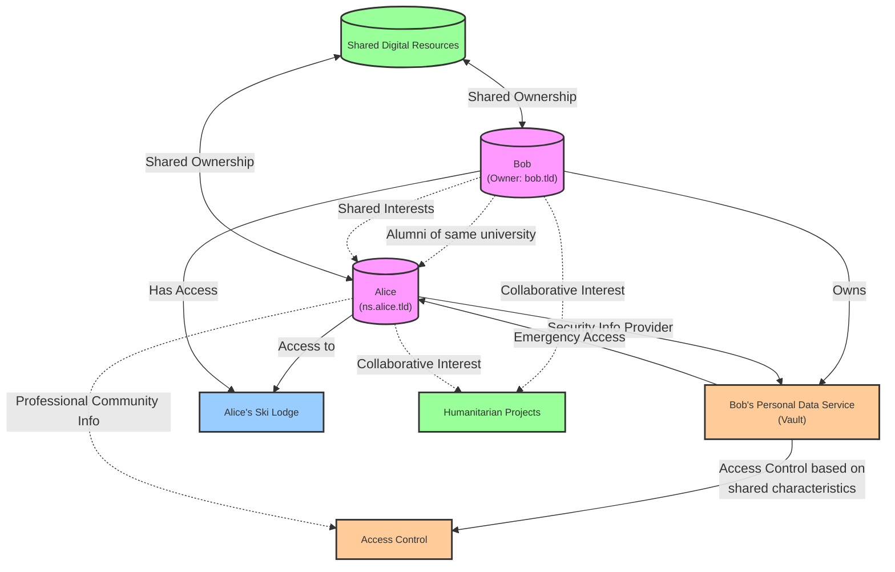

# Concept Maps

## What are Concept Maps?

A concept map is the ability to provide a 'frame' or series of 'shapes' that act to define a particular fragment of thoughtware. 

## What are they used for?

1. Managing relationships
2. Managing interactions with Topics
3. Managing 'automation' processes
4. other.


## Problem Statement

in Web 2.0 the development of 'social' web-portals, such as facebook, linkedin, twitter, myspace and various others; has led to the structure of relationships between largely defined by each of those 'silos' in a way that best suited the silo provider, not otherwise for natural users.  

When asking Chat GPT 4 **"how do people structure their relationships in reality,  civil society, sociologically."** it provides the following response.

---

Structuring relationships in civil society is a complex and multifaceted process that is influenced by a myriad of social, cultural, economic, and personal factors. Sociologically, relationships are organized around several axes and structures. Here’s a broad overview of some key aspects:

1. **Familial Relationships**: These are typically structured by blood relations or marriage. Families can be nuclear, extended, or part of more complex kinship systems that dictate roles, responsibilities, and hierarchies.

2. **Social Networks**: Relationships form a network of connections between friends, acquaintances, colleagues, and others. These networks are influenced by shared interests, activities, backgrounds, and social roles.

3. **Community Ties**: People are often connected through geographic communities, whether they are neighborhoods, villages, or cities, and through community institutions like schools, places of worship, and local organizations.

4. **Professional Relationships**: These are structured around work and career. Professional hierarchies, organizational structures, and industry networks play a significant role in shaping these relationships.

5. **Associative and Voluntary Relationships**: These are seen in civil society organizations, clubs, and interest groups where membership is often based on shared goals, interests, or values.

6. **Civic and Political Structures**: Citizens relate to each other within the frameworks provided by governmental and political structures, including citizenship, political parties, civic movements, and public forums.

7. **Cultural and Ethnic Bonds**: Cultural heritage, ethnicity, and linguistic ties can form the basis for strong community relationships, often spanning national and international borders.

8. **Economic Structures**: The economic system and class structures influence relationships through socioeconomic status, economic activities, and consumer behaviors.

9. **Educational Systems**: Schools and educational institutions structure relationships among students, teachers, and educational staff, as well as between educational and familial systems.

10. **Romantic and Intimate Relationships**: These personal relationships can be structured formally through marriage or partnerships, or informally as dating or cohabitation.

11. **Formal and Informal Hierarchies**: In all these areas, there are formal hierarchies (like a company's org chart or government positions) and informal hierarchies (like perceived leaders in social groups).

12. **Virtual and Online Communities**: With the advent of the internet, people also form relationships in online communities, social media platforms, and through other digital means, which may follow different structures and dynamics compared to offline relationships.

Sociologists study these relationships using various theories and models, such as social exchange theory, structural functionalism, network theory, and symbolic interactionism, to understand how individuals and groups interact and form social bonds. Each of these structures provides a framework for expectations, obligations, and social norms that guide how relationships operate and evolve.

---

So, the way these sorts of practical associative modalities work in reality, is not the same as how we've been shaped into restructing them to work online.  This leads to many different sorts of problems, but, that is not the focus of today.  The other aspect that is defined by the 'social network' platforms online; is a variety of different systems that are said to support and help us with our safety, privacy and ability to discover new opportnities and/or possibilities.  This is particularly the case with social networks devoted to romance or business, but is largely otherwise - broadly defined, in a 'platform centric' kinda manner - via tools often said to be 'free'.

So, when people connect with one-another via the internet using tools that do not need any of these platforms; then, there is a challenge about how to define tools to support how people naturally want to define relationships with one-another..  both, via inferencing and declarative statements or recipies - so, this is where 'concept maps', play a role by providing general 'gist' concepts, that can then be more broadly applied than could otherwise occur.  These 'concept maps' are then used to manage permissions across networks, and as the concepts develop, change or become applied or decoupled from particular sites, systems, agents and things; helps to automate these changes.

---

## using ChatGPT, both a mermaid diagram and shacl example has been illustrated below; although, both are simplified.
A 'concept map' for access control between bob's personal data service and alice, that is based upon a series of characteristics and shared interests.   Bob owns bob.tld and his public linked-data end-point is ns.bob.tld and alice has the same at ns.alice.tld.

Bob and alice went to university together and were romatically together historically for a period of time, however they are now happily involved with other people, but have remained friends.  

They both studied computer science, quantum physics, sociology, philosophy of science, web science, psychology and political sciences and continue to have shared interests in these fields and want to share information they find publicly online with one another. they are also interested in collaborating on humanitarian projects and share professional community information, as part of a broader community.   Alice is one of three security information providers for bob, who, if done with the other providers, have the ability to contribute the cryptographic information needed to access bobs vault  in case of emergency or death.

Bob has the information to access Alice's ski-lodge on specific weeks of the year; and they continue to share some digital resources that they originally purchased when they were together.




```turtle

@prefix sh: <http://www.w3.org/ns/shacl#> .
@prefix acl: <http://www.w3.org/ns/auth/acl#> .
@prefix schema: <http://schema.org/> .
@prefix ex: <http://example.org/ns#> .
@prefix nsBob: <http://ns.bob.tld/> .
@prefix nsAlice: <http://ns.alice.tld/> .

# Define a shape for the access control relationship between Bob and Alice

ex:SharedInterestShape
  a sh:NodeShape ;
  sh:targetClass acl:Authorization ;
  sh:property [
    sh:path schema:knows ;
    sh:nodeKind sh:IRI ;
    sh:hasValue nsAlice:Alice ; # Alice's IRI
    sh:message "Alice must be a known associate." ;
  ] ;
  sh:property [
    sh:path schema:alumniOf ;
    sh:hasValue ex:University ; # Assuming both went to the same university
    sh:message "Both parties should be alumni of the same university." ;
  ] ;
  sh:property [
    sh:path ex:sharedInterest ;
    sh:minCount 1 ;
    sh:or ( 
      [ sh:hasValue ex:ComputerScience ] 
      [ sh:hasValue ex:QuantumPhysics ]
      [ sh:hasValue ex:Sociology ]
      [ sh:hasValue ex:PhilosophyOfScience ]
      [ sh:hasValue ex:WebScience ]
      [ sh:hasValue ex:Psychology ]
      [ sh:hasValue ex:PoliticalSciences ]
      [ sh:hasValue ex:HumanitarianProjects ]
    ) ;
    sh:message "Bob and Alice must share at least one interest." ;
  ] ;
  sh:property [
    sh:path ex:emergencyAccessProvider ;
    sh:minCount 1 ;
    sh:maxCount 3 ;
    sh:class ex:SecurityInformationProvider ;
    sh:message "Alice must be one of the providers for emergency access." ;
  ] ;
  sh:property [
    sh:path ex:resourceAccess ;
    sh:class ex:SharedResource ;
    sh:node ex:SharedResourceShape ; # Another shape defining the structure of shared resources
  ] .

# Define a shape for the shared resources
ex:SharedResourceShape
  a sh:NodeShape ;
  sh:property [
    sh:path schema:owns ;
    sh:class schema:Person ;
    sh:hasValue nsBob:Bob ; # Bob owns the resource
    sh:message "Resource must be owned by Bob." ;
  ] ;
  sh:property [
    sh:path ex:accessAllowedTo ;
    sh:class schema:Person ;
    sh:hasValue nsAlice:Alice ; # Access is allowed to Alice
    sh:message "Alice must have access to the resource." ;
  ] ;
  sh:property [
    sh:path schema:usageInfo ;
    sh:datatype xsd:string ;
    sh:message "Usage information must be a string." ;
  ] .

```

